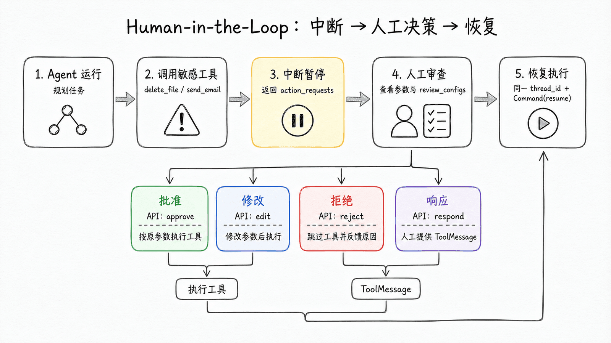
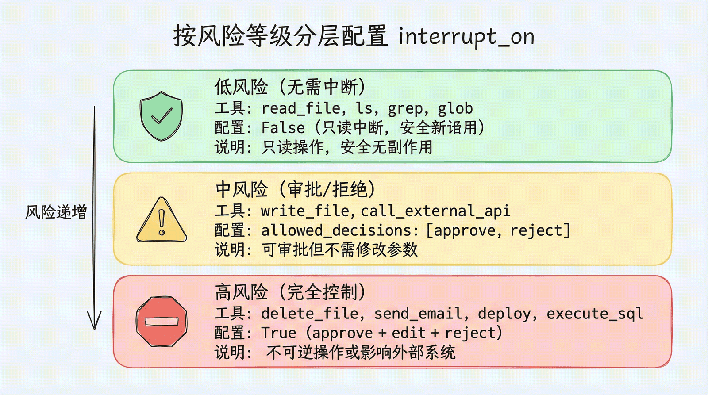
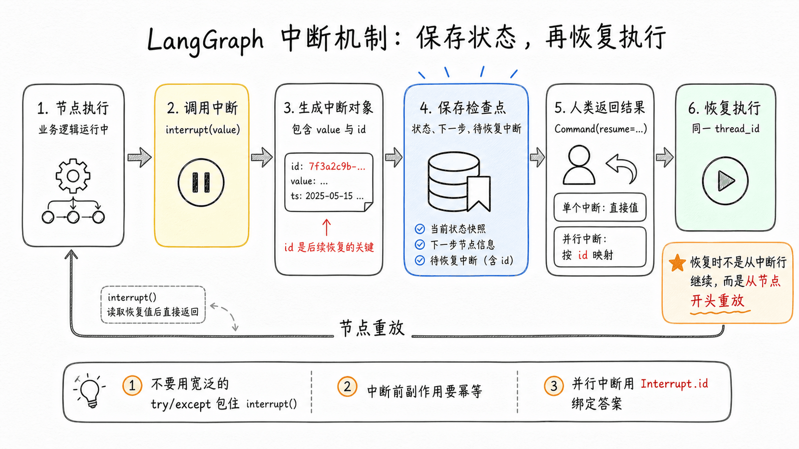

# 第 9 章：Human-in-the-Loop — 构建安全的人机协作流程

> Agent 越自主，就越需要安全边界。当 Agent 准备删除文件、发送邮件或调用付费 API 时，你是否希望它先"问一声"？本章学习 Human-in-the-Loop（人机协作），为敏感操作添加人工审批。

## 为什么需要 Human-in-the-Loop？

Agent 的自主性是一把双刃剑：

- **好处**：能独立完成复杂任务，减少人工干预
- **风险**：可能执行危险操作——删错文件、发错邮件、调用昂贵的 API

在实际项目中，完全自主和完全人工之间，需要一个**可控的中间地带**：

- 删除文件前，先让用户确认
- 发送邮件前，让用户检查收件人和内容
- 修改生产配置前，必须获得审批

这就是 Human-in-the-Loop（HITL）——Agent 在执行特定操作前**暂停**，等待人类**审批、修改、拒绝或直接响应**，然后再继续执行。

## `interrupt_on` 配置

Deep Agents 通过 `interrupt_on` 参数配置哪些工具需要人工审批。设置后，Deep Agents 会在默认中间件栈中加入 `HumanInTheLoopMiddleware`；如果运行在工具返回前被中断或取消，同一栈里的 `PatchToolCallsMiddleware` 会自动修复消息历史。

```python
import os
from langchain_openai import ChatOpenAI
from langchain.tools import tool
from deepagents import create_deep_agent
from langgraph.checkpoint.memory import MemorySaver

model = ChatOpenAI(
    model=os.environ.get("MODEL_NAME", "Pro/zai-org/GLM-5.1"),
    api_key=os.environ["SILICONFLOW_API_KEY"],
    base_url="https://api.siliconflow.cn/v1",
)

@tool
def delete_file(path: str) -> str:
    """删除指定文件。"""
    return f"已删除 {path}"

@tool
def read_file(path: str) -> str:
    """读取文件内容。"""
    return f"{path} 的内容..."

@tool
def send_email(to: str, subject: str, body: str) -> str:
    """发送邮件。"""
    return f"邮件已发送至 {to}"

# Checkpointer 是 HITL 的必要条件
checkpointer = MemorySaver()

agent = create_deep_agent(
    model=model,
    tools=[delete_file, read_file, send_email],
    interrupt_on={
        "delete_file": {"allowed_decisions": ["approve", "edit", "reject"]},
        "read_file": False,    # 无需中断
        "send_email": {"allowed_decisions": ["approve", "reject"]},  # 只能审批或拒绝，不能修改
    },
    checkpointer=checkpointer,  # 必须配置！
)
```

### 三种配置值

| 配置值 | 含义 |
|---|---|
| `True` | 启用中断，允许所有决策（approve / edit / reject / respond） |
| `False` | 不中断，Agent 直接执行 |
| `{"allowed_decisions": [...]}` | 启用中断，只允许指定的决策类型 |

### 四种决策类型

| 决策 | 含义 | 场景 |
|---|---|---|
| `approve` | 批准执行，使用 Agent 提出的原始参数 | "确认删除这个文件" |
| `edit` | 修改参数后执行 | "收件人改一下再发" |
| `reject` | 跳过此次工具调用，并把拒绝原因反馈给 Agent | "不要删除，取消" |
| `respond` | 不执行工具，把人的 `message` 当作一次成功的合成工具结果返回 | `ask_user` 这类"询问用户"工具 |

注意：**拒绝副作用工具时用 `reject`，不要用 `respond`**。`respond` 的内容会被模型当作一次成功的 ToolMessage，更适合人类临时代替工具回答问题；删除文件、发送邮件、部署上线这类工具应该用 `reject` 明确告诉 Agent 工具没有执行。

可以把它记成三条规则：

- **不同意执行**：用 `reject`，并在 `message` 里说明原因和下一步
- **同意但要改参数**：用 `edit`，只修改必要参数
- **工具本来就是问人**：用 `respond`，让人的回答成为工具结果

## 条件中断：只拦截真正危险的调用

默认情况下，只要工具名出现在 `interrupt_on` 里，每次调用都会暂停。如果你只想拦截某些参数组合，可以在配置中加入 `when` 谓词函数。该函数接收 `ToolCallRequest`，返回 `True` 表示中断，返回 `False` 表示自动放行。

> 条件中断需要 `langchain>=1.3.3`。

```python
from deepagents import create_deep_agent
from langchain.agents.middleware import ToolCallRequest
from langgraph.checkpoint.memory import MemorySaver


def writes_outside_workspace(request: ToolCallRequest) -> bool:
    """只有写入工作区外的路径时才暂停。"""
    path = request.tool_call["args"].get("file_path", "")
    return not path.startswith("/workspace/")


agent = create_deep_agent(
    model=model,
    interrupt_on={
        "write_file": {
            "allowed_decisions": ["approve", "edit", "reject"],
            "when": writes_outside_workspace,
        },
    },
    checkpointer=MemorySaver(),
)
```

当 `when` 返回 `False` 时，这次工具调用不会加入中断批次；审批界面只需要展示真正需要人工决策的动作。

## 中断与恢复：完整流程

当 Agent 调用一个配置了 `interrupt_on` 的工具时，执行流程变为：

**1. Agent 正常运行，直到调用敏感工具**
**2. 执行暂停，返回中断信息**
**3. 用户检查中断内容，做出决策**
**4. 用相同的 `thread_id` 恢复执行**



代码实现：

```python
import uuid
from langgraph.types import Command

# 创建一个 thread_id（恢复时必须使用同一个）
config = {"configurable": {"thread_id": str(uuid.uuid4())}}

# Step 1: 发起请求
result = agent.invoke(
    {"messages": [{"role": "user", "content": "删除 temp.txt 文件"}]},
    config=config,
    version="v2",
)

# Step 2: 检查是否中断
if result.interrupts:
    interrupt_value = result.interrupts[0].value
    action_requests = interrupt_value["action_requests"]
    review_configs = interrupt_value["review_configs"]
    config_map = {cfg["action_name"]: cfg for cfg in review_configs}

    # 展示给用户
    for action in action_requests:
        review_config = config_map[action["name"]]
        args = action.get("arguments", action.get("args", {}))
        print(f"工具: {action['name']}")
        print(f"参数: {args}")
        print(f"可选决策: {review_config['allowed_decisions']}")

    # Step 3: 用户做出决策
    decisions = [
        {"type": "approve"}  # 用户批准删除
    ]

    # Step 4: 恢复执行（必须用相同的 config！）
    result = agent.invoke(
        Command(resume={"decisions": decisions}),
        config=config,     # 同一个 thread_id
        version="v2",
    )

# 获取最终结果
print(result.value["messages"][-1].content)
```

### 关键要求

- **必须配置 Checkpointer**：HITL 依赖状态持久化，没有 Checkpointer 无法恢复
- **必须使用相同的 `thread_id`**：中断和恢复必须在同一个线程中
- **必须使用 `version="v2"`**：HITL 需要 v2 版本的 invoke 接口
- **决策数量和顺序必须匹配**：`decisions` 要和 `action_requests` 一一对应，顺序不能乱

> 字段名说明：Deep Agents 文档示例里常见 `action_request["args"]`，LangChain 标准 `HumanInTheLoopMiddleware` 示例里展示的是 `action_request["arguments"]`。如果你的审批界面要兼容两种入口，可以像上面的代码一样读取 `arguments`，没有时再回退到 `args`。但恢复 `edit` 决策时，`edited_action` 仍然使用 `args`。

## 拒绝时写清楚反馈

当用户返回 `reject` 时，Deep Agents 会跳过该工具调用，并把拒绝反馈返回给 Agent。如果不传 `message`，默认反馈会告诉模型工具没有执行、不要重复调用同一个工具。对于敏感工具，建议写清楚下一步应该怎么做：

```python
decisions = [{
    "type": "reject",
    "message": "用户拒绝删除该文件。不要再次尝试删除，请询问是否改为归档文件。",
}]
```

## 直接响应：只用于问用户的工具

`respond` 不是"软拒绝"，而是"人类亲自返回工具结果"。它适合专门设计成占位的 `ask_user` 工具：工具调用本身不执行，人的回答直接作为成功的工具结果交还给 Agent。

```python
from langchain.tools import tool


@tool
def ask_user(question: str) -> str:
    """向用户提问；真实回答由 HITL 的 respond 决策提供。"""
    return "等待用户回答"


agent = create_deep_agent(
    model=model,
    tools=[ask_user],
    interrupt_on={
        "ask_user": {"allowed_decisions": ["respond"]},
    },
    checkpointer=checkpointer,
)

decisions = [{
    "type": "respond",
    "message": "使用季度维度，并排除测试数据。",
}]
```

这里的 `message` 会被 Agent 当作 `ask_user` 的成功返回值。如果人的意思是"不要执行删除/发送/部署"，仍然应该用 `reject`；如果只是改收件人、路径或 SQL 条件，应该用 `edit`。

## 编辑工具参数

当决策类型包含 `edit` 时，用户可以修改工具的参数再执行：

```python
if result.interrupts:
    interrupt_value = result.interrupts[0].value
    action_request = interrupt_value["action_requests"][0]

    # Agent 原始参数
    original_args = action_request.get("arguments", action_request.get("args", {}))
    print(original_args)
    # {"to": "all@example.com", "subject": "通知", "body": "..."}

    # 用户决定修改收件人
    decisions = [{
        "type": "edit",
        "edited_action": {
            "name": action_request["name"],  # 必须包含工具名
            "args": {
                "to": "team@example.com",    # 修改后的收件人
                "subject": "通知",
                "body": "...",
            }
        }
    }]

    result = agent.invoke(
        Command(resume={"decisions": decisions}),
        config=config,
        version="v2",
    )
```

编辑时尽量只做保守修改，例如改收件人、路径或 SQL 条件。大幅改写工具参数可能让模型重新评估原计划，进而重复调用工具或走向你没有预期的动作。

## 批量工具调用的中断处理

当 Agent 同时调用多个需要审批的工具时，所有中断会**打包成一个**。你需要按顺序为每个工具提供决策：

```python
# 用户请求："删除 temp.txt 并发邮件通知 admin"
result = agent.invoke(
    {"messages": [{"role": "user", "content": "删除 temp.txt 并发邮件通知 admin@example.com"}]},
    config=config,
    version="v2",
)

if result.interrupts:
    action_requests = result.interrupts[0].value["action_requests"]
    # action_requests[0] = delete_file(path="temp.txt")
    # action_requests[1] = send_email(to="admin@example.com", ...)

    # 按顺序提供决策
    decisions = [
        {"type": "approve"},  # 批准删除
        {
            "type": "reject",
            "message": "用户拒绝发送邮件。不要重试这次发送动作。",
        },
    ]

    result = agent.invoke(
        Command(resume={"decisions": decisions}),
        config=config,
        version="v2",
    )
```

## 子 Agent 的中断配置

子 Agent 可以有**独立的** `interrupt_on` 配置，覆盖主 Agent 的设置：

```python
agent = create_deep_agent(
    model=model,
    tools=[delete_file, read_file],
    interrupt_on={
        "delete_file": True,
        "read_file": False,    # 主 Agent 读文件不需要审批
    },
    subagents=[{
        "name": "file-manager",
        "description": "管理文件操作",
        "system_prompt": "你是文件管理助手。",
        "tools": [delete_file, read_file],
        "interrupt_on": {
            "delete_file": True,
            "read_file": True,  # 子 Agent 读文件也需要审批！
        }
    }],
    checkpointer=checkpointer,
)
```

这样设计的场景很实际：主 Agent 是你信任的，但子 Agent 可能操作更敏感的数据，需要更严格的审批策略。

## 按风险等级分层的最佳实践

不是所有工具都需要同等程度的审批。推荐按风险等级分三层配置：

```python
interrupt_on = {
    # === 高风险：审批 + 修改 + 拒绝，不开放 respond ===
    "delete_file": {"allowed_decisions": ["approve", "edit", "reject"]},
    "send_email": {"allowed_decisions": ["approve", "edit", "reject"]},
    "execute_sql": {"allowed_decisions": ["approve", "edit", "reject"]},
    "deploy_to_production": {"allowed_decisions": ["approve", "edit", "reject"]},

    # === 中风险：审批或拒绝（不允许修改参数）===
    "write_file": {"allowed_decisions": ["approve", "reject"]},
    "call_external_api": {"allowed_decisions": ["approve", "reject"]},

    # === 低风险：无需中断 ===
    "read_file": False,
    "ls": False,
    "grep": False,
    "glob": False,

    # === 人工输入型：人类就是工具结果 ===
    "ask_user": {"allowed_decisions": ["respond"]},
}
```



| 风险等级 | 工具类型 | 配置 | 理由 |
|---|---|---|---|
| 高风险 | 删除、发送、部署 | `approve/edit/reject` | 操作不可逆或影响外部系统，避免 `respond` 被误当成成功结果 |
| 中风险 | 写入、外部调用 | `approve/reject` | 可审批但不需要修改参数 |
| 低风险 | 读取、搜索、列表 | `False` | 只读操作，安全无副作用 |
| 人工输入型 | 询问偏好、补充缺失信息 | `respond` | 工具本来就是让人回答，人的 `message` 会成为成功工具结果 |

## 文件系统权限中断

除了 `interrupt_on`，Deep Agents 的内置文件系统工具也可以通过权限规则触发中断。这个能力需要 `deepagents>=0.6.8`。当 `write_file` 或 `edit_file` 命中 `mode="interrupt"` 的权限规则时，Deep Agents 会抛出和普通工具审批相同格式的 HITL 中断：

```python
from deepagents import FilesystemPermission, create_deep_agent
from langgraph.checkpoint.memory import MemorySaver

agent = create_deep_agent(
    model=model,
    permissions=[
        FilesystemPermission(
            operations=["write"],
            paths=["/secrets/**"],
            mode="interrupt",
        ),
    ],
    checkpointer=MemorySaver(),
)
```

恢复方式和普通工具一致：检查 `result.interrupts[0].value["action_requests"]`，然后用 `Command(resume={"decisions": [...]})` 继续执行。文件系统权限中断会和你传入的 `interrupt_on` 合并，因此一次人工审查可以同时覆盖自定义工具和受保护文件路径。

## 揭开引擎盖：LangGraph 的中断机制

`interrupt_on` 的底层是 LangGraph 的<strong>中断（Interrupt）</strong>原语。当你在工具中直接调用 `interrupt()` 函数时，可以实现更灵活的审批逻辑：

```python
from langgraph.types import interrupt

@tool
def request_approval(action_description: str) -> str:
    """请求人工审批。"""
    # interrupt() 暂停执行，返回值是 Command(resume=...) 传入的数据
    approval = interrupt({
        "type": "approval_request",
        "action": action_description,
        "message": f"请审批：{action_description}",
    })

    if approval.get("approved"):
        return f"操作 '{action_description}' 已获批准，继续执行..."
    else:
        reason = approval.get("reason", "未提供原因")
        return f"操作 '{action_description}' 被拒绝，原因：{reason}"
```

恢复时传入审批结果：

```python
# 审批通过
result = agent.invoke(
    Command(resume={"approved": True}),
    config=config,
    version="v2",
)

# 审批拒绝
result = agent.invoke(
    Command(resume={"approved": False, "reason": "时机不对，延后执行"}),
    config=config,
    version="v2",
)
```

`interrupt()` 是 LangGraph 的底层能力，`interrupt_on` 是 Deep Agents 在此基础上封装的更易用的配置接口。

### 运行时视角：一次中断到底保存了什么？

从 LangGraph 的运行时机制看，`interrupt()` 不是普通的 `input()`。它会把控制权从图执行器交还给调用方，并把恢复所需的信息保存下来：

1. 当前节点调用 `interrupt(value)`
2. 运行时把 `value` 包装成 `Interrupt` 对象，里面包含给人类审查的数据和一个稳定的 `id`
3. 运行时通过 Checkpointer 保存当前线程状态、下一步节点、待恢复中断等信息
4. 这次执行暂停，调用方拿到 `stream.interrupts` 或 `result.interrupts`
5. 人类返回 `Command(resume=...)`
6. 运行时根据同一个 `thread_id` 找回 checkpoint，把恢复值送回对应的 `interrupt()` 调用

所以，HITL 的关键不是"弹一个确认框"，而是让工作流在任意时间跨度后仍然能安全恢复：几秒后恢复、几小时后恢复，甚至换一个进程恢复，只要 Checkpointer 还在、`thread_id` 还一致。



### 单个中断 vs 并行中断

如果同一时间只有一个 `interrupt()` 暂停，`Command(resume=...)` 可以直接传入一个值：

```python
from langgraph.types import Command

# interrupt("是否继续？") 的返回值会变成 "yes"
graph.invoke(Command(resume="yes"), config=config)
```

但如果并行分支同时触发多个中断，就不要依赖顺序了。更稳妥的做法是用 `Interrupt.id` 建立映射：

```python
from langgraph.types import Command

# stream.interrupts = (Interrupt(value="question_a", id="..."),
#                      Interrupt(value="question_b", id="..."))
resume_map = {
    intr.id: f"answer for {intr.value}"
    for intr in stream.interrupts
}

graph.invoke(Command(resume=resume_map), config=config)
```

这就是运行机制比界面呈现更底层的地方：界面可以显示成两个审批卡片，但恢复时最好让每个答案绑定到自己的中断 ID，避免并行节点、子图或重排导致回答错配。

### 如何检查暂停在哪里？

当图暂停后，你可以查看 thread 的状态快照。状态快照通常包含：

- `values`：当前图状态
- `next`：下一步待执行节点
- `interrupts`：当前 step 中待解决的 `Interrupt` 对象
- `checkpoint`：当前 checkpoint 标识

在本地 `CompiledStateGraph` 里，可以用同一个 config 查询：

```python
snapshot = graph.get_state(config)

print(snapshot.values)      # 当前状态
print(snapshot.next)        # 下一步节点
print(snapshot.interrupts)  # 待处理的中断
```

在 LangGraph Platform / SDK 场景，则可以通过 thread API 查询同一件事：

```python
thread_state = client.threads.get_state(thread_id="thread-1")
print(thread_state["values"])
print(thread_state["next"])
```

这对排查"为什么没有继续执行"很有用：如果 `interrupts` 还在，说明还缺 resume；如果 `thread_id` 不对，你看到的会是另一个线程的状态。

### interrupt() 的工作原理

理解 `interrupt()` 的内部机制，能帮你避免常见的坑：

1. **暂停方式**：`interrupt()` 通过**抛出一个特殊异常**来暂停执行。这个异常会沿调用栈向上传播，被 LangGraph 运行时捕获
2. **状态保存**：运行时通过 Checkpointer 保存当前图状态（消息、文件、任务清单等）
3. **恢复方式**：当你调用 `Command(resume=...)` 时，LangGraph 加载保存的状态，**从节点的开头重新执行**
4. **返回值**：`Command(resume=...)` 中的值成为 `interrupt()` 的返回值

关键点在第 3 步：**恢复时节点从头重新执行**，而不是从 `interrupt()` 那一行继续。这意味着 `interrupt()` 之前的代码会**再跑一次**。

### interrupt() 的使用规则

基于上面的原理，有几条重要的规则：

**规则 1：不要用 try/except 包裹 interrupt()**

因为 `interrupt()` 通过异常暂停，裸的 `try/except` 会吞掉这个异常：

```python
# ❌ 错误：裸 except 会捕获 interrupt 异常
try:
    result = interrupt("请审批")
except Exception as e:
    print(e)  # 这会吞掉 interrupt！

# ✅ 正确：使用具体的异常类型
try:
    result = interrupt("请审批")
    fetch_data()
except NetworkError as e:  # 只捕获特定异常
    print(e)
```

**规则 2：interrupt() 之前的副作用必须是幂等的**

因为恢复时节点从头执行，`interrupt()` 之前的代码会再跑一次：

```python
# ❌ 错误：interrupt 前创建记录，恢复时会创建重复记录
def node(state):
    db.create_log("操作开始")  # 每次恢复都会再创建一条！
    approved = interrupt("请审批")
    return {"approved": approved}

# ✅ 正确：用 upsert（幂等操作），或把副作用放到 interrupt 之后
def node(state):
    approved = interrupt("请审批")
    if approved:
        db.create_log("操作已审批")  # 只在审批后执行一次
    return {"approved": approved}
```

**规则 3：不要动态改变 interrupt() 的调用顺序**

同一个节点中多个 `interrupt()` 的匹配是**按索引**的：

```python
# ✅ 正确：每次执行顺序一致
def node(state):
    name = interrupt("你叫什么名字？")
    age = interrupt("你多大了？")
    return {"name": name, "age": age}

# ❌ 错误：条件跳过会导致索引错位
def node(state):
    name = interrupt("你叫什么名字？")
    if state.get("need_age"):     # 这个条件可能在恢复时变化！
        age = interrupt("你多大了？")
    city = interrupt("你在哪个城市？")  # 索引错位
```

**规则 4：并行中断用 ID 映射恢复**

同一个节点内多个 `interrupt()` 依赖调用顺序；多个并行节点同时中断时，应该用 `Interrupt.id` 映射恢复值：

```python
resume = {
    intr.id: ui_answers[intr.id]
    for intr in stream.interrupts
}

graph.invoke(Command(resume=resume), config=config)
```

这样界面可以自由排序审批卡片，但恢复执行时仍然知道每个答案属于哪一个中断。

**规则 5：resume 之后会从节点开头重放**

这条和规则 2 类似，但更偏底层执行机制：恢复不是从 `interrupt()` 的下一行继续执行，而是加载 checkpoint 后重放当前节点。`interrupt()` 会用已有恢复值直接返回，不再暂停。

因此，节点代码要能承受"中断前逻辑被再次执行"。凡是不能重复执行的动作，都应该放在 `interrupt()` 之后，或者做成幂等操作。

### 更多模式：输入验证

如果要做人类输入校验，不要在同一个节点里写 `while True` 然后反复调用 `interrupt()`。因为每次恢复都会从节点开头重放，循环里的前几轮也会跟着重跑，输入越多，重复执行越明显。

更稳的做法是：每次节点执行只调用一次 `interrupt()`，把下一轮要问的问题写回状态，再用条件边决定是否回到同一个节点：

```python
from typing import TypedDict

from langgraph.graph import END, START, StateGraph
from langgraph.types import interrupt


class FormState(TypedDict):
    age: int | None
    pending_question: str | None


def collect_age(state: FormState):
    question = state.get("pending_question") or "请输入你的年龄："
    answer = interrupt(question)  # 每次节点执行只暂停一次

    if isinstance(answer, int) and answer > 0:
        return {"age": answer, "pending_question": None}

    return {
        "pending_question": f"'{answer}' 不是有效年龄，请输入正整数。"
    }


def route(state: FormState):
    return END if state.get("age") is not None else "collect_age"


builder = StateGraph(FormState)
builder.add_node("collect_age", collect_age)
builder.add_edge(START, "collect_age")
builder.add_conditional_edges("collect_age", route)
```

这样每次恢复只处理一次回答。回答无效时，图通过条件边回到 `collect_age`，下一次中断会展示更新后的提示；回答有效时，流程结束。

### 静态中断：调试利器

除了 `interrupt()` 函数（动态中断），LangGraph 还支持**静态中断**——在编译时指定哪些节点前后暂停，用于调试：

```python
# 在 node_a 之前暂停，在 node_b 之后暂停
graph = builder.compile(
    interrupt_before=["node_a"],
    interrupt_after=["node_b"],
    checkpointer=checkpointer,
)

config = {"configurable": {"thread_id": "debug-001"}}
graph.invoke(inputs, config=config)   # 执行到 node_a 前暂停
graph.invoke(None, config=config)     # 传入 None 继续执行
```

静态中断适合开发阶段的逐步调试，**不推荐**用于生产环境的人机协作——那应该用 `interrupt()` 函数。

### 什么时候直接使用底层 interrupt()？

Deep Agents 的 `interrupt_on` 已经覆盖了大多数"工具调用前审批"场景。只有当你要控制**图节点级别**的流程时，才需要直接使用 `interrupt()`：

| 场景 | 推荐方式 | 原因 |
|---|---|---|
| 给某个工具加审批 | `interrupt_on` | 配置简单，自动生成 action request 和 ToolMessage |
| 按工具参数决定是否审批 | `interrupt_on` + `when` | 保留 Deep Agents 的工具审查格式 |
| 在节点中收集缺失信息 | 直接调用 `interrupt()` | 不是工具审批，而是业务流程缺字段 |
| 做多轮表单/输入验证 | 直接调用 `interrupt()` + 条件边 | 每次只暂停一次，无效输入通过状态回路重新提问 |
| 调试图执行路径 | `interrupt_before` / `interrupt_after` | 静态断点不需要改节点代码 |
| 并行人工任务汇总 | 底层 `interrupt()` + ID 到恢复值映射 | 需要精确绑定多个并行中断 |

理解了这些底层机制，你就可以构建更复杂的审批工作流——多级审批、条件审批、带验证的人工输入、并行人工任务，甚至跨子图的中断传播。

## 小结

本章我们学习了 Deep Agents 的人机协作能力：

1. **为什么需要 HITL**：Agent 越自主，越需要安全边界——敏感操作前暂停，等待人类决策
2. **`interrupt_on` 配置**：按工具名映射中断策略，四种决策类型（approve / edit / reject / respond）
3. **条件中断**：用 `when` 谓词只拦截真正需要人工审查的工具调用
4. **中断与恢复流程**：Agent 暂停 → 用户决策 → `Command(resume=...)` 恢复，必须同一个 `thread_id`
5. **子 Agent 独立配置**：子 Agent 可以有比主 Agent 更严格的审批策略
6. **按风险分层**：高风险审批/修改/拒绝、中风险审批/拒绝、低风险无需中断
7. **文件系统权限中断**：用 `FilesystemPermission(..., mode="interrupt")` 保护敏感路径
8. **底层机制**：`interrupt()` 通过异常暂停 + Checkpointer 保存状态 + 恢复时节点从头执行。核心规则：不要裸 try/except、副作用要幂等、不要动态改变调用顺序，并行中断用 ID 映射恢复
9. **扩展模式**：输入验证（单次 interrupt + 条件边回到节点）、静态中断（调试用 interrupt_before/after）

下一章，我们将学习沙箱执行——让 Agent 在受控环境中安全地运行代码。
