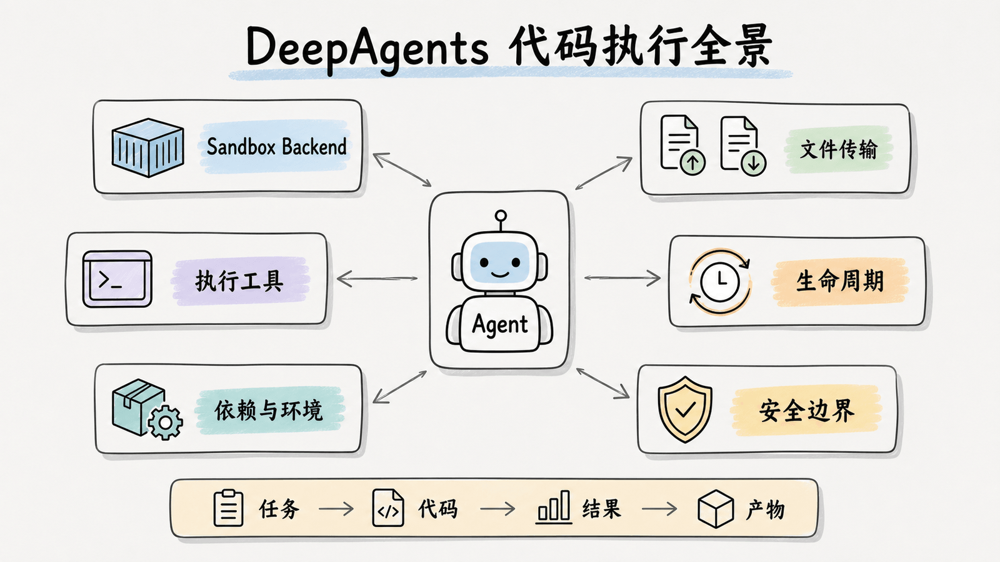
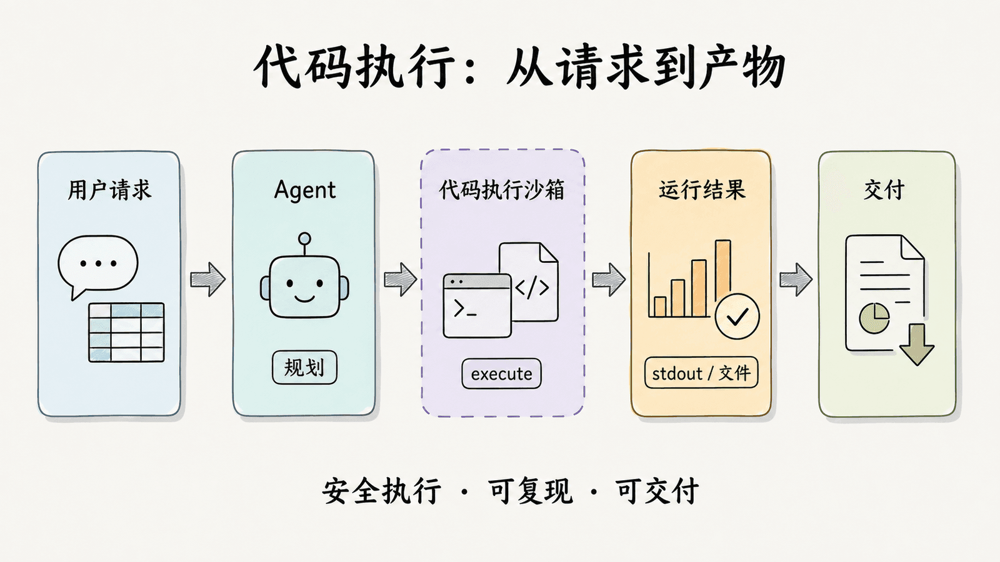
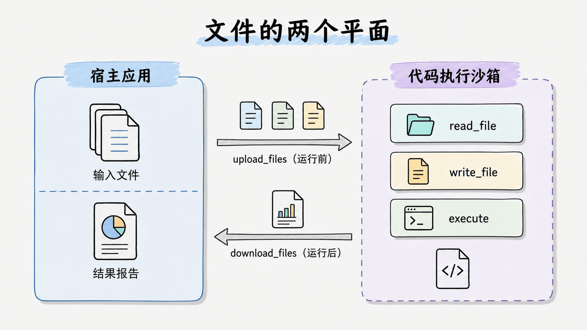
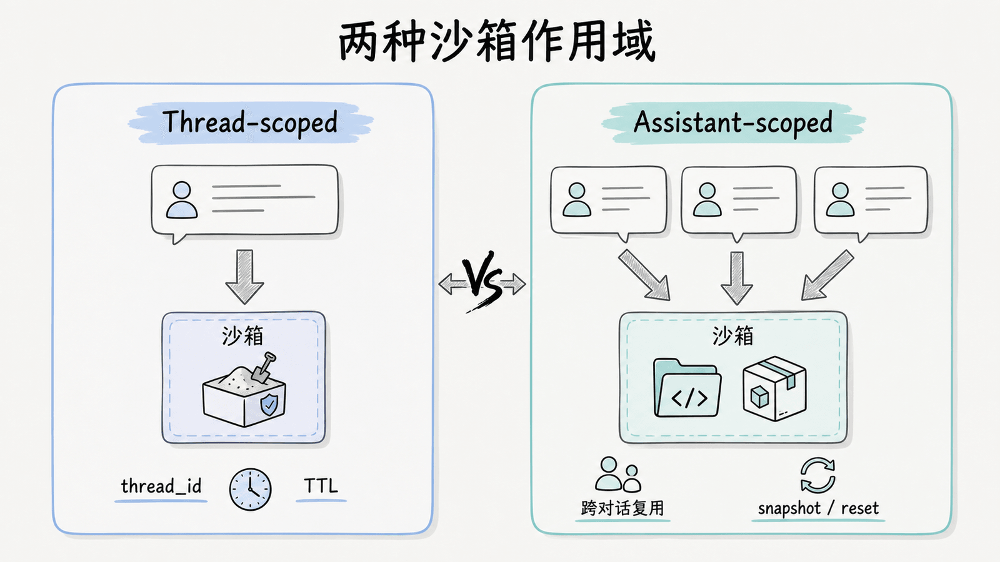

# 第 10 章：沙箱执行 — 让 Agent 安全地运行代码

> 能写文件、运行 Shell、安装依赖的 Agent，已经不只是“回答问题”的模型，而是能改变运行环境的执行者。本章把这份能力放进隔离沙箱：既让 Agent 可以编程、分析数据和运行测试，也让宿主机的文件、进程和凭证留在边界之外。

本章覆盖三层不同的能力，先分清再组合：

1. **Deep Agents Python Backend**：把远程沙箱接到 `create_deep_agent()`，为 Agent 提供文件系统工具与 `execute`。
2. **Deep Agents Code（`dcode`）**：命令行工具在本机运行 LLM 循环，把工具调用定向到远程沙箱。
3. **LangSmith Sandboxes**：LangSmith 提供的一方托管沙箱产品，除了 Python Backend 以外，还提供快照、服务 URL、Auth Proxy、挂载和 CLI 等资源能力。



## 1. 沙箱 Backend：执行环境，而不是权限开关

在 Deep Agents 中，沙箱是一种 **Backend**。普通 Backend（`StateBackend`、`FilesystemBackend`、`StoreBackend` 等）只实现文件读写；沙箱 Backend 还实现 `execute()`，因此 Agent 能在隔离环境里运行 Shell 命令。

| 能力 | 普通 Backend | 沙箱 Backend |
|---|---|---|
| 文件工具 | `ls`、`read_file`、`write_file`、`edit_file`、`delete`、`glob`、`grep` | 同样支持 |
| Shell 执行 | 不提供 | `execute` |
| 环境 | Backend 指向的存储 | 与宿主机隔离的远程执行环境 |
| 典型任务 | 计划、笔记、资料读写 | 编码、测试、数据分析、产物生成 |

传入沙箱 Backend 后，Deep Agents 会在每次模型调用前检查它是否实现了 `SandboxBackendProtocol`；只有满足该协议，模型才会看到 `execute` 工具。沙箱基类会把其他文件操作构造成沙箱中的脚本执行，因此提供商接入的核心通常就是可靠地实现 `execute()`。



### `execute()` 的返回值

Agent 向 `execute` 传入 `command` 字符串，得到：

- 合并后的标准输出与错误输出
- 命令退出码
- 输出过大时的截断提示

过大的输出不会直接塞进模型上下文，而会保存为文件，并提示 Agent 用 `read_file` 分段查看。这使得编译日志、测试报告和大数据输出不会挤占上下文窗口。

应用代码也可以直接调用 Backend 的 `execute()`，用于健康检查或在 Agent 运行前准备环境：

```python
from deepagents.backends.langsmith import LangSmithSandbox
from langsmith.sandbox import SandboxClient

client = SandboxClient()
sandbox = client.create_sandbox(template_name="deepagents-deploy")
backend = LangSmithSandbox(sandbox=sandbox)

try:
    result = backend.execute("python --version")
    print(result.output)
finally:
    client.delete_sandbox(sandbox.name)
```

## 2. 隔离边界：保护什么，不保护什么

所有沙箱提供商都应把 Agent 的文件系统与 Shell 操作同宿主机隔离：Agent 不能读取本地文件、访问本机环境变量，或干扰其他进程。这样，`rm`、安装依赖、测试失败或错误脚本都被限制在远程环境内。

但这不等于 Agent 自动可信。沙箱**不能**单独防御两种风险：

| 风险 | 为什么仍然存在 | 要做什么 |
|---|---|---|
| 上下文注入 | 攻击者若能影响输入，仍可诱导 Agent 在沙箱内执行命令 | 不把秘密放进沙箱；审查高风险工具；使用 HITL |
| 网络外传 | 未限制网络时，Agent 可通过 HTTP 或 DNS 把沙箱内数据发出 | 不需要网络时阻断；最小化可访问数据；监控出站流量 |

例如 Modal 支持网络阻断配置（`blockNetwork: true`）；其他提供商也应优先检查自己的网络控制能力。安全目标不是“沙箱内绝不会出错”，而是让错误、恶意输入和不可信产物不能越过宿主边界。

## 3. 快速上手：LangSmithSandbox

LangSmith 是 Deep Agents 官方文档中的一方托管示例。安装 Python SDK：

```bash
uv add "langsmith[sandbox]"
# 或 pip install "langsmith[sandbox]"
```

把 `SandboxClient` 创建的远程环境包装为 Backend，再交给 Agent：

```python
from deepagents import create_deep_agent
from deepagents.backends import LangSmithSandbox
from langchain_anthropic import ChatAnthropic
from langsmith.sandbox import SandboxClient

client = SandboxClient()
ls_sandbox = client.create_sandbox()
backend = LangSmithSandbox(sandbox=ls_sandbox)

agent = create_deep_agent(
    model=ChatAnthropic(model="claude-sonnet-4-6"),
    system_prompt="You are a Python coding assistant with sandbox access.",
    backend=backend,
)

try:
    result = agent.invoke({
        "messages": [{
            "role": "user",
            "content": "Create a small Python package and run pytest",
        }]
    })
    print(result["messages"][-1].content)
finally:
    # 远程资源会持续消耗配额或费用；无论成功失败都清理。
    client.delete_sandbox(ls_sandbox.name)
```

这里的模型和 Agent 在宿主服务一侧；只有文件工具和 `execute` 通过 Provider API 落到远程沙箱。这正是后文推荐的 **Sandbox as tool** 模式。

## 4. 当前 Python 沙箱集成

下表列出当前官方 Sandboxes 文档覆盖的 Python Backend 集成。它们共享 Deep Agents 的工具语义，但创建和销毁动作属于各自 Provider，不能混用。

| Provider | 安装包 | Backend | 创建方式 | 清理方式 |
|---|---|---|---|---|
| LangSmith | `langsmith[sandbox]` | `LangSmithSandbox` | `SandboxClient().create_sandbox()` | `client.delete_sandbox(name)` |
| AgentCore | `langchain-agentcore-codeinterpreter` | `AgentCoreSandbox` | `CodeInterpreter(...).start()` | `interpreter.stop()` |
| Daytona | `langchain-daytona` | `DaytonaSandbox` | `Daytona().create()` | `sandbox.stop()` |
| E2B | `langchain-e2b` | `E2BSandbox` | `Sandbox.create()` | `sandbox.kill()` |
| Modal | `langchain-modal` | `ModalSandbox` | `modal.Sandbox.create(app=...)` | `sandbox.terminate()` |
| NVIDIA OpenShell | `langchain-nvidia-openshell` | `OpenShellSandbox` | `openshell.Sandbox(...)` | `delete_on_exit=True` 上下文清理 |
| Runloop | `langchain-runloop` | `RunloopSandbox` | `RunloopSDK(...).devbox.create()` | `devbox.shutdown()` |
| Vercel | `langchain-vercel-sandbox` | `VercelSandbox` | `Sandbox.create()` | `sandbox.stop()` |

以 Daytona 为例，Provider 对象先创建远程环境，包装器负责把它适配为 Deep Agents Backend：

```python
from daytona import Daytona
from deepagents import create_deep_agent
from langchain_anthropic import ChatAnthropic
from langchain_daytona import DaytonaSandbox

sandbox = Daytona().create()
backend = DaytonaSandbox(sandbox=sandbox)

agent = create_deep_agent(
    model=ChatAnthropic(model="claude-sonnet-4-6"),
    system_prompt="You are a Python coding assistant with sandbox access.",
    backend=backend,
)

try:
    agent.invoke({"messages": [{"role": "user", "content": "Run the test suite"}]})
finally:
    sandbox.stop()
```

选择 Provider 时，先确认运行区域、生命周期与回收策略、网络与凭证控制、镜像或依赖管理能力；再进入各集成的官方文档完成账号和认证配置。不要只因为某个示例能运行，就假设它满足生产数据或合规要求。

## 5. 两种集成模式

沙箱运行的是代码；Agent 自身可以在沙箱内，也可以在宿主服务中。两种模式的差别决定了凭证、状态和部署成本的边界。

| 模式 | Agent 在哪里 | 优点 | 代价与适用条件 |
|---|---|---|---|
| Agent in sandbox | Agent 框架和工具都在沙箱内 | 与本地环境接近；运行时与 Agent 紧密耦合 | 需要构建镜像、提供 HTTP/WebSocket 通信层，API Key 会处于沙箱内；仅在 Provider 已妥善处理通信且必须复现本地运行环境时考虑 |
| Sandbox as tool | LLM 循环、记忆和调度在宿主；执行工具调用远程沙箱 | Agent 逻辑可即时迭代；密钥和 Agent 状态留在沙箱外；可并行多个沙箱；故障不丢 Agent 状态 | 每次工具调用有网络延迟；多数 Deep Agents 应用的首选 |

Agent in sandbox 的最小镜像思路如下：

```dockerfile
FROM python:3.11
RUN pip install deepagents-code
```

但镜像并不解决密钥问题：如果 Agent 能读取容器环境变量，提示注入同样可能让它外传。除非你确实需要把 Agent 运行时和执行环境打包在一起，否则优先选择 Sandbox as tool。

## 6. 文件有两个平面

“文件在沙箱中”并不意味着 Agent 可以访问宿主机文件。需要严格区分两个平面：

| 调用方 | API | 作用 |
|---|---|---|
| LLM / Agent | `read_file`、`write_file`、`edit_file`、`delete`、`ls`、`glob`、`grep`、`execute` | 只在沙箱内部完成任务 |
| 宿主应用 | `upload_files()`、`download_files()` | 用 Provider 原生文件传输跨越宿主机与沙箱边界 |



### 在运行前播种输入

`upload_files()` 将源代码、配置或数据放进沙箱。路径使用绝对路径，内容使用 `bytes`：

```python
backend.upload_files([
    ("/src/index.py", b"print('Hello')\n"),
    ("/pyproject.toml", b"[project]\nname = 'my-app'\n"),
])
```

这也是预置依赖描述文件、基准数据或任务模板的正确位置；不要让模型通过猜测宿主路径寻找输入。

### 在运行后提取产物

`download_files()` 用于取回生成的代码、构建产物、报告或图表。每个文件都有独立成功/失败结果，应逐项处理：

```python
results = backend.download_files(["/src/index.py", "/output.txt"])

for result in results:
    if result.content is not None:
        print(f"{result.path}: {result.content.decode()}")
    else:
        print(f"Failed to download {result.path}: {result.error}")
```

传输 API 由应用控制、走 Provider 的原生传输通道，不是 Agent 运行的一条 Shell 命令。这也是输入与产物审查的天然边界。

## 7. 生命周期与作用域

沙箱包含文件、安装的包、缓存与可能仍在运行的进程。创建后不清理会持续消耗资源；复用时又会引入状态累积。因此先确定作用域。



| 作用域 | 行为 | 适用情况 | 风险控制 |
|---|---|---|---|
| Thread-scoped（默认） | 每个对话线程一个沙箱；同一 `thread_id` 的后续轮次复用 | 每个用户任务独立 | 用 `idle_ttl_seconds` 自动回收空闲环境 |
| Assistant-scoped | 同一 Assistant 的所有线程共用一个沙箱 | 需要跨对话保留仓库、依赖或缓存 | 配置 TTL，使用快照重置，或执行周期性清理 |

### Thread-scoped：按对话复用

在图工厂中，用稳定的 sandbox name 保存 `thread_id` 与沙箱的对应关系：

```python
from deepagents import create_deep_agent
from deepagents.backends.langsmith import LangSmithSandbox
from langchain_core.runnables import RunnableConfig
from langsmith.sandbox import SandboxClient

client = SandboxClient()

async def thread_agent(config: RunnableConfig):
    thread_id = config["configurable"]["thread_id"]
    sandbox_name = f"thread-{thread_id}"
    existing = [
        sb for sb in client.list_sandboxes()
        if getattr(sb, "name", None) == sandbox_name
    ]
    ls_sandbox = existing[0] if existing else client.create_sandbox(
        name=sandbox_name,
        idle_ttl_seconds=3600,
    )
    return create_deep_agent(
        model="google_genai:gemini-3.5-flash",
        backend=LangSmithSandbox(sandbox=ls_sandbox),
    )
```

首次对话创建沙箱；同一线程的下一轮会找到并复用它。用户离开后由 Provider 的 TTL 删除或归档环境。

### Assistant-scoped：跨对话复用

若目标是长时间维护一个代码库或已安装依赖，改用 `assistant_id`：

```python
from deepagents import create_deep_agent
from deepagents.backends.langsmith import LangSmithSandbox
from langchain_core.runnables import RunnableConfig
from langsmith.sandbox import SandboxClient

client = SandboxClient()

async def assistant_agent(config: RunnableConfig):
    assistant_id = config["configurable"]["assistant_id"]
    sandbox_name = f"assistant-{assistant_id}"
    existing = [
        sb for sb in client.list_sandboxes()
        if getattr(sb, "name", None) == sandbox_name
    ]
    ls_sandbox = existing[0] if existing else client.create_sandbox(
        name=sandbox_name,
    )
    return create_deep_agent(
        model="google_genai:gemini-3.5-flash",
        backend=LangSmithSandbox(sandbox=ls_sandbox),
    )
```

此模式会保留文件、包和克隆的仓库，也因此不能放任增长：为 Provider 设置 TTL，定期从快照重建，或主动清理磁盘和内存。

## 8. Deep Agents Code：把工具调用指向远程沙箱

Deep Agents Code（`dcode`）使用 Sandbox as tool：`dcode` 进程在本机运行 LLM 循环、记忆与工具调度，但 `read_file`、`write_file`、`execute` 等工具实际操作远程沙箱，而不是本地文件系统。

### 内置、第三方与配置提供商

不要把它和上一节的 Python Backend 列表混为一谈：

| 来源 | Deep Agents Code 当前路径 |
|---|---|
| 内置 Provider | `langsmith`、`agentcore`、`daytona`、`modal`、`runloop`、`vercel` |
| 第三方 Provider | 已安装包通过 Python entry point 发布；例如 `langchain-e2b` 提供 `e2b` |
| 配置 Provider | `~/.deepagents/config.toml` 下的 `[sandboxes.providers]` 声明 |

同名 Provider 的优先级为：**配置声明 > 第三方 entry point > 内置 Provider**。这意味着应用内配置可以覆盖默认集成；同时也意味着 `class_path` 会导入并运行本地 Python，必须只指向受信任模块。

安装单个扩展或一次安装全部扩展：

```bash
dcode --install daytona
dcode --install all-sandboxes

# E2B 是第三方包路径，而不是 dcode 的内置 Provider。
dcode --install langchain-e2b --package
dcode --sandbox e2b
```

### 关键 CLI 参数

| 参数 | 含义 |
|---|---|
| `--sandbox TYPE` | 选择 Provider；省略值时使用配置中的 `[sandboxes].default` |
| `--sandbox-id ID` | 重新连接已有沙箱，跳过创建和清理；只有 Provider 支持重连时可用 |
| `--sandbox-snapshot-name NAME` | 使用或创建快照；LangSmith、Runloop 和声明支持快照的第三方 Provider 可用；不能与 `--sandbox-id` 同时使用 |
| `--sandbox-setup PATH` | 创建后在沙箱内运行设置脚本 |

示例：

```bash
# 新建 LangSmith 沙箱
dcode --sandbox langsmith

# 重连 Runloop devbox：不会自动创建或清理
dcode --sandbox runloop --sandbox-id dbx_abc123

# 创建后运行设置脚本
dcode --sandbox modal --sandbox-setup ./setup.sh

# 使用 config.toml 中的默认 Provider；裸 --sandbox 必须放在命令最后
dcode --sandbox
```

`--sandbox` 的值是可选的；若把裸参数放在中间，后续参数可能被误解析为 Provider 名。因此要么显式写名称，要么把裸 `--sandbox` 放在命令行末尾。

### 默认工作目录

设置脚本与 `execute` 默认在各 Provider 的工作目录中运行；需要相对路径时尤其要注意：

| Provider | 默认工作目录 |
|---|---|
| LangSmith | `/root` |
| AgentCore | `/tmp` |
| Daytona | `/home/daytona` |
| Modal | `/workspace` |
| Runloop | `/home/user` |
| Vercel | `/vercel/sandbox` |

### 设置脚本的边界

`--sandbox-setup` 适合克隆受信任仓库、安装依赖或准备非敏感环境。Deep Agents Code 会用本地环境变量展开脚本中的 `${VAR}`；这不是把秘密“安全地传给沙箱”的机制。若脚本把 Token 写入沙箱，提示注入的 Agent 就可能读取并外传它。

因此只对受信任脚本使用此功能；秘密应优先留在宿主工具中。如果确实必须注入短时凭证，结合完整工具审批、网络限制、最小权限和出站监控，并承认这仍是不安全的权宜之计。

## 9. LangSmith 托管沙箱：不止是一个 Backend

LangSmith Sandboxes 是托管产品。当前文档列出 GCP US、GCP EU、GCP APAC 和 AWS US 环境为 Generally Available。它既可以单独运行代码，也可通过 `LangSmithSandbox` 接入 Deep Agents。

### 独立 SDK 使用

Python 直接使用上下文管理器，会在退出时自动清理：

```python
from langsmith.sandbox import SandboxClient

client = SandboxClient()

with client.sandbox() as sandbox:
    result = sandbox.run("python -c 'print(2 + 2)'")
    print(result.stdout)
```

TypeScript SDK 也可以直接创建、运行和删除：

```ts
import { SandboxClient } from "langsmith/sandbox";

const client = new SandboxClient();
const sandbox = await client.createSandbox();
const result = await sandbox.run("node -e 'console.log(2 + 2)'");
console.log(result.stdout);
await sandbox.delete();
```

### 托管资源能力

| 能力 | 用途 |
|---|---|
| Snapshots | 从 Docker 镜像构建文件系统映像，或捕获运行中的沙箱并从快照启动 |
| Service URLs | 通过认证 URL 访问沙箱内运行的 HTTP 服务 |
| Auth Proxy | 为出站 API 请求注入凭证，避免把凭证硬编码进沙箱 |
| Mounts | 将 S3、GCS 或公开 Git 仓库挂载到沙箱文件系统 |
| Permissions | 控制工作区成员创建后能否与沙箱交互 |
| Sandbox CLI | 创建/管理沙箱、打开交互式控制台、构建快照和隧道 TCP 端口 |
| Python / TypeScript SDK | 以代码方式创建、运行、管理沙箱 |
| Harbor | 在沙箱上运行 Harbor 评估与 rollout |

Auth Proxy 是“沙箱需要访问已认证服务”时比复制 API Key 更好的选择：沙箱向代理发普通请求，代理在转发前添加认证头，Agent 本身看不到秘密。它仍应配合网络策略和最小权限，而不能取代输入安全。

## 10. 扩展：自定义 Backend 与自定义 dcode Provider

这两个扩展点解决不同问题：

| 需求 | 应该扩展什么 |
|---|---|
| 在 Python Agent 中接入新的执行环境 | 实现 `SandboxBackendProtocol` |
| 让用户可以运行 `dcode --sandbox acme` | 实现并注册 `SandboxProvider` |

### Python Agent：实现 SandboxBackendProtocol

普通 `BackendProtocol` 覆盖 `ls`、`read`、`write`、`edit`、`glob`、`grep`，可选 `delete`；要获得 `execute`，实现扩展后的 `SandboxBackendProtocol`。沙箱基类会在 `execute()` 上构建文件系统工具。

实现规则：

- `execute()` 运行 Shell 命令并返回结构化结果
- 失败时在结果的 `error` 字段报告，不要抛出异常
- 未实现 `delete` 时，模型会自动看不到删除工具
- 文件权限可在 Backend 调用之前应用于内置文件工具；这与第 9 章的 HITL / 权限策略可以组合

这使自定义 Provider 的重点集中在远程执行协议、命令输出和错误映射，而不必重新实现每一个文件工具。

### Deep Agents Code：发布 SandboxProvider

若要发布 `dcode` Provider，继承 `SandboxProvider`，提供元数据、`get_or_create()` 和 `delete()`，然后在包的 `pyproject.toml` 中注册 `deepagents_code.sandbox_providers` entry point。最小元数据需表明 Provider 名、默认工作目录、安装提示，以及是否支持 sandbox ID 和 snapshot name。

对于不想打包的内部 Provider，可在 `~/.deepagents/config.toml` 中的 `[sandboxes.providers.<name>]` 声明 `class_path`、`working_dir`、`package`、能力标记和传给 `get_or_create()` 的参数。这个配置能覆盖内置 Provider，但因为会导入任意 Python，配置文件本身必须受本机信任边界保护。

## 11. 可观测性与安全闭环

### 观测沙箱执行

LangSmith traces 可以展示 Agent 在沙箱中运行了哪些 Shell 命令、如何调用文件工具。排查“为什么 Agent 改了文件”“命令为何失败”时，应先看 trace，而不是从最终回复猜测执行过程。LangSmith Engine 可以持续监控 trace、检测问题并提出修复建议。

### 凭证：永远优先留在沙箱外

推荐顺序如下：

1. **宿主侧认证工具（首选）**：把认证逻辑和秘密保留在应用服务；Agent 调用工具名，但看不到凭证。
2. **Auth Proxy / 凭证注入代理**：沙箱发普通请求，代理在转发时添加认证头；只在 Provider 支持时使用。
3. **把凭证注入沙箱（不推荐）**：环境变量、挂载文件和 Provider `secrets` 选项都可能被上下文注入攻击读取并外传。

如果业务暂时无法避免第三种做法，官方建议同时做到：

- 为**所有**工具调用启用 Human-in-the-Loop，而不只是敏感工具
- 阻断或限制沙箱网络
- 使用最小作用域、最短生命周期的凭证
- 监控异常出站网络流量

即使如此，创造性的提示注入仍可能绕过输出过滤和审批，所以这只能是临时风险缓解，不是安全保证。

### 产物：默认不可信

最后一层边界在宿主应用：

- 在使用沙箱输出前审查代码、报告、构建物和下载文件
- 不需要联网时关闭网络
- 用 Middleware 过滤或脱敏工具输出中的敏感模式
- 将沙箱生产的一切都当作不可信输入，而不是可直接执行或发布的结果

沙箱、宿主侧凭证、网络控制、HITL、观测和产物审查共同组成安全闭环；任何单独一层都不足以让 Agent 的副作用自动安全。

## 本章小结

- 沙箱 Backend 为 Deep Agents 增加隔离文件系统与 `execute`，并通过 `SandboxBackendProtocol` 决定模型能否使用 Shell
- 选择 Python Provider 时要按创建、清理、网络与生命周期语义逐一核对；不要混用 Provider API
- `upload_files()` / `download_files()` 由宿主应用控制，和 Agent 的沙箱内文件工具属于两个平面
- Thread-scoped 与 Assistant-scoped 复用分别解决任务隔离与环境连续性，TTL、快照和清理策略不可省略
- `dcode` 的远程沙箱模式有独立的内置 Provider、第三方发现、配置覆盖和 CLI 参数语义
- LangSmith 托管沙箱还提供快照、服务 URL、Auth Proxy、挂载、权限、CLI、SDK 与 Harbor
- 永远不要把长期凭证放进沙箱；沙箱输出默认不可信，提示注入和网络外传必须在体系设计中处理

## 官方参考

- [Deep Agents Sandboxes](https://docs.langchain.com/oss/python/deepagents/sandboxes)
- [Deep Agents Backends](https://docs.langchain.com/oss/python/deepagents/backends)
- [Deep Agents Code — Use remote sandboxes](https://docs.langchain.com/oss/python/deepagents/code/remote-sandboxes)
- [LangSmith Sandboxes](https://docs.langchain.com/langsmith/sandboxes)
